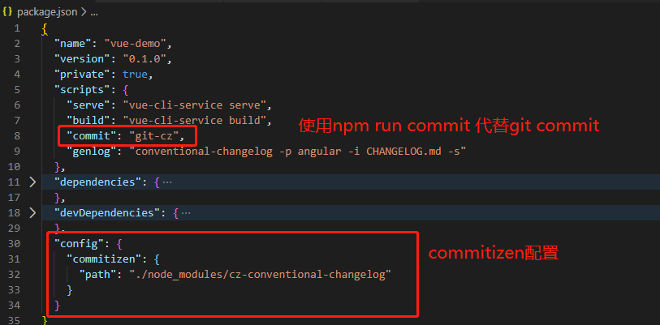

**代码质量控制**

- eslint + prettier  
  Prettier 工具主要用来统一代码格式的，eslint 也会对代码进行一定程度的格式校验，但主要是用来对代码规范的扫描，而 prettier 则是专门用来对代码进行格式化，两个工具各司其职。
- husky + link stage  
  husky 注册 git 的钩子函数保证在 git 执行 commit 时调用代码扫描。  
  int-staged 保证只对当前 add 的文件进行检测。

* 依赖包有

```text
   "husky": "^7.0.4",
   "lint-staged": "^12.1.4",
   "@commitlint/cli": "^12.1.4",
   "@commitlint/config-conventional": "^12.1.4",
   "commitizen": "^4.2.4",
   "cz-conventional-changelog": "^3.3.0",
```

```text
2.1 执行流程
达到上述效果，执行的流程如下：

1. 待提交的代码git add 添加到暂存区；
2. 执行 git commit；
3. husky注册在git pre-commit的钩子函数被调用，执行lint-staged；
4. lint-staged 取得所有被提交的文件依次执行写好的任务（ESLint 和 Prettier）；
5. 如果有错误（没通过ESlint检查）则停止任务，同时打印错误信息，等待修复后再执行commit；
6. 成功commit，可push到远程
```

**配置 husky + link-staged**

```text
//安装依赖
yarn add husky lint-staged

//修改package.json
"husky": {
    "hooks": {
      "pre-commit": "lint-staged"
    }
  },
  "lint-staged": {
    "src/**/*.{js,jsx,ts,tsx}": [
      "eslint --fix",
      "git add"
    ],
    "src/**/*.{html,css,scss,md,json}": [
      "prettier --write",
      "git add"
    ]
  }
```

** 创建 commitlint.config.js **

```text
/**
 * build：主要目的是修改项目构建系统(例如 glup，webpack，rollup 的配置等)的提交
 * ci：主要目的是修改项目继续集成流程(例如 Travis，Jenkins，GitLab CI，Circle等)的提交
 * docs：文档更新
 * feat：新增功能
 * merge：分支合并 Merge branch ? of ?
 * fix：bug 修复
 * perf：性能, 体验优化
 * refactor：重构代码(既没有新增功能，也没有修复 bug)
 * style：不影响程序逻辑的代码修改(修改空白字符，格式缩进，补全缺失的分号等，没有改变代码逻辑)
 * test：新增测试用例或是更新现有测试
 * revert：回滚某个更早之前的提交
 * chore：不属于以上类型的其他类型
 */

module.exports = {
  ignores: [(commit) => commit.includes('init')],
  extends: ['@commitlint/config-conventional'],
  rules: {
    'body-leading-blank': [2, 'always'],
    'footer-leading-blank': [1, 'always'],
    'header-max-length': [2, 'always', 108],
    'subject-empty': [2, 'never'],
    'type-empty': [2, 'never'],
    'type-enum': [
      2,
      'always',
      [
        'feat',
        'fix',
        'perf',
        'style',
        'docs',
        'test',
        'refactor',
        'build',
        'ci',
        'chore',
        'revert',
        'wip',
        'workflow',
        'types',
        'release',
      ],
    ],
  },
};

```

**执行下面命令会.husky 文件夹下创建对应的文件**

```text
yarn husky add .husky/commit-msg 'yarn commitlint --edit "$1"'
git add .husky/commit-msg

yarn husky add .husky/pre-commit 'yarn lint-staged --allow-empty "$1"'
git add .husky/pre-commit
```

当不按规范来提交 commit 时，就会报错，并阻止提交代码

### 代码规范提交

代码规范提交可以很好的保存代码修改日志，规范提交日志对于定位问题或代码回退具有极大意义。

```text
//安装插件
yarn add commitizen --dev
yarn add cz-conventional-changelog --dev
yarn add conventional-changelog-cli --dev
```

**Commitizen 插件**：使用 Commitizen 提交时，系统将提示您在提交时填写所有必需的提交字段。不需要再等到稍后 git 提交钩子函数来检测提交内容从而拒绝您的提交请求。  
**cz-conventional-changelog**用来规范提交信息。
**conventional-changelog-cli**：从 git metadata 生成变更日志。

修改 package.json,添加如下内容

```text
"config": {
    "commitizen": {
      "path": "./node_modules/cz-conventional-changelog"
    }
  }
```

**提交代码方式**

- 使用 yarn run commit 方式，一步步填写提交信息
  

- 使用 git commit，并填写提交 type, 如: fix: bug description
  这里会被 husky 的钩子函数拦截并检查和格式化代码

**将改动添加到 changlog 文件中去**

```text
npm run genlog
```
